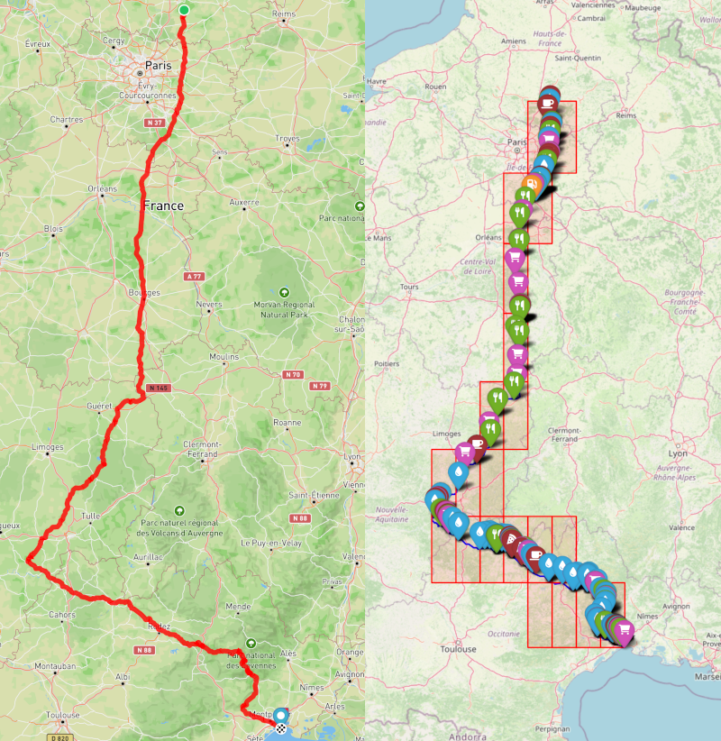

[](https://github.com/berettavexee/thirsty/stargazers)
<p align="center">

</p>

# Thirsty

Add hydration points to your GPX tracks automatically 🚴‍♂️💧

Thirsty is a Python tool that enhances your GPX files by adding Points of Interest (POIs) — drinking water, food, and supplies — to your cycling or running routes. It queries OpenStreetMap via the Overpass API and adds matching waypoints directly to your GPX file.

Designed for long-distance events: a 30,000-point track spanning 1,000+ km is processed in under a minute.

This project is a fork of the original script by [jsleroy](https://github.com/jsleroy/thirsty/).

## 📷 Screenshots

### Add points of interest to your GPX

<p align="center">

</p>

### Visualise on a map

<p align="center">

</p>

### Simple command-line interface

<p align="center">

</p>

## Features

- **Overpass API querying** — fetches POIs from OpenStreetMap for any GPX route.
- **Response caching** — Overpass results are cached on disk for 7 days (`~/.cache/thirsty/overpass/`) to avoid redundant requests and server load. Expired cache files are cleaned up automatically.
- **Multi-server failover** — rotates across three Overpass endpoints with automatic retries if one is slow or overloaded.
- **Adaptive bounding box splitting** — large routes are split into smaller query areas; areas with no track points are skipped entirely.
- **KD-tree proximity filtering** — efficiently keeps only POIs within the configured distance of the track, even on routes with tens of thousands of points.
- **HTML map generation** — produces an interactive Folium map with the track, POIs, and optional query bboxes overlaid.
- **Web interface** — a Flask app exposes all features through a browser UI with real-time progress updates.
- **GPX and URL input** — accepts local files or remote GPX URLs.

## POI types

By default Thirsty searches for all supported POI types. Use `--poi-type` / `-p` to restrict the search.

| Key                | Description                                                              |
|:-------------------|:-------------------------------------------------------------------------|
| `water`            | Public drinking water fountains (`amenity=drinking_water`).              |
| `point`            | Potable water refill stations (`amenity=water_point`).                   |
| `tap`              | Taps explicitly tagged as potable (`man_made=water_tap`).                |
| `spring`           | Natural springs tagged as potable (`natural=spring`).                    |
| `fountain`         | Decorative fountains explicitly marked as potable (`amenity=fountain`).  |
| `bakery`           | Bakeries (`shop=bakery`).                                                |
| `cafe`             | Cafés (`amenity=cafe`).                                                  |
| `fuel_convenience` | Fuel stations (`amenity=fuel`).                                          |
| `convenience_store`| Convenience stores (`shop=convenience`).                                 |
| `pizza_vending`    | 24-hour pizza vending machines (`amenity=vending_machine`).              |

## ⚙️ Installation

```bash
git clone https://github.com/berettavexee/thirsty
cd thirsty
python3 -m venv venv
source venv/bin/activate
pip install .
```

For the web interface, also install the Flask extras:

```bash
pip install -r requirements-gui.txt
```

Python 3.9 or later is required.

## CLI usage

```
thirsty <gpx_input> <gpx_output> [options]
```

### Options

| Option | Default | Description |
|:---|:---:|:---|
| `--poi-type` / `-p` | all | POI type to search for. Repeatable. |
| `--max-distance` / `-d` | 100 | Max distance in metres from the track to retain a POI. |
| `--max-bbox-area` | 0.5 | Max Overpass query area in square degrees before subdivision. |
| `--lat-divisions` | 2 | Number of latitude splits when subdividing a large bbox. |
| `--lon-divisions` | 2 | Number of longitude splits when subdividing a large bbox. |
| `--html` | off | Generate an interactive HTML map alongside the GPX output. |
| `--show-bboxes` | off | Draw the Overpass query bboxes on the HTML map (useful for debugging). |

### Examples

Add all POI types along a route (100 m search radius):

```bash
thirsty input.gpx output.gpx
```

Water points and bakeries only, 200 m radius, with an HTML map:

```bash
thirsty input.gpx output.gpx -p water -p tap -p spring -p bakery -d 200 --html
```

## Web interface

Start the Flask server:

```bash
python app.py
```

Then open `http://localhost:5000` in your browser. Upload a GPX file, choose your options, and download the enriched GPX or HTML map when processing is complete. Progress is streamed in real time.

## How it works

1. **Parse GPX** — the track is read and sanitised.
2. **Compute bounding box** — expanded by `max_distance` to capture edge POIs.
3. **Subdivide** — the bbox is recursively split until each tile is below `max_bbox_area`. Tiles with no track points are discarded.
4. **Query Overpass** — each tile is queried (cache-first). Results are fetched from one of three endpoints with automatic failover.
5. **Deduplicate** — POIs returned by overlapping tiles are merged by their Overpass ID.
6. **Filter by distance** — a KD-tree pre-filter followed by an exact Haversine check keeps only POIs within `max_distance` of any track point.
7. **Write output** — matching POIs are added as waypoints to the GPX file. An HTML map is generated if requested.

## Development

```bash
pip install -e ".[dev]"
pre-commit install
```

### Project structure

```
thirsty/
├── thirsty/
│   ├── core.py   # All processing logic (GPX, Overpass, KD-tree, caching)
│   └── cli.py    # Command-line interface
├── app.py        # Flask web application
├── templates/    # HTML templates for the web UI
├── static/       # CSS / JS assets
└── setup.py
```

## Contributing

1. Fork this repository and create a new branch.
2. Make your changes and commit them following [Conventional Commits](https://www.conventionalcommits.org/).
3. Push your changes to your fork.
4. Open a Pull Request with a description of what changed and why.

## License

This project is licensed under the [GNU GPL v3 License](LICENSE).
