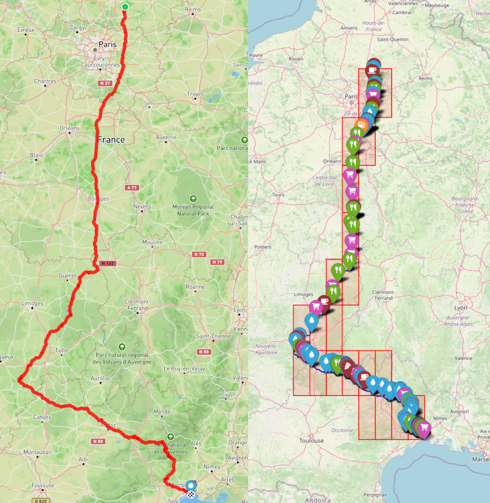

[](https://github.com/berettavexee/thirsty/stargazers)
<p align="center">

</p>

# Thirsty

Add hydration points to your GPX tracks automatically 🚴‍♂️💧

Thirsty is a Python tool that enhances your GPX files by adding Points of Interest (POIs), particularly drinking water and foods points, to your cycling or running routes. It integrates with the Overpass API to query OpenStreetMap for relevant points along your route and adds them to the GPX file. Ideal for long-distance cycling events, ultra races, or any activity where hydration points matter!

This script is a fork of the original script from [jsleroy](https://github.com/jsleroy/thirsty/).

This version allows you to process a GPX file containing 30,000 points and a route of over 1,000 kilometers in less than a minute on most computers.
This is a niche use case that should only concern people preparing for multi-day ultracycling events. 

## 📷 Screenshots

### Add points of interest to Your GPX

<p align="center">

</p>

### Visualize on a Map

<p align="center">

</p>

### Simple Command-Line Interface

<p align="center">

</p>

## Features

- **Query Overpass API**: Fetch drinking water POIs from OpenStreetMap.
- **Bounding Box Filtering**: Filter POIs around a defined area to match your GPX route.
- **Distance-based Filtering**: Ensures POIs are within a defined proximity of your GPX track.
- **Supports GPX from URL and Local Files**: Easily work with GPX files from your device or download them from a URL.
- **In-Memory Handling**: No need for temporary files; everything is handled in memory for speed.
- **Progress Bar**: Monitor download and processing progress with the `rich` module.

## Additional feature

- **Ultra distance**: Support for routes covering thousands of kilometers.
- **Bakery, Café, and Pizza robot**: more points of interest supported.


## POI Type Selection

By default, **Thirsty** searches for all supported POIs.
You can customize which types of potable water points you want to add using the `--poi-type` (or `-p`) option.

- You can specify **one or more** POI types by repeating the `-p` option.
- If no `-p` option is specified, `drinking_water` will be used automatically.

### Available POI types

| POI Type        | Description                                                            |
|:----------------|:-----------------------------------------------------------------------|
| `drinking_water` | Public drinking water fountains (default).                            |
| `water_point`    | Water refill stations for caravans, RVs, or marinas (only potable ones). |
| `water_tap`      | Taps providing potable water.                                          |
| `spring`         | Natural springs with potable water.                                   |
| `fountain`       | Public decorative fountains explicitly marked as potable.             |
| `bakery`         | Bakery                                                                |
| `cafe`           | Cafe                                                                  |
| `fuel_convenience`| Gas station with a convenience store                                 |
| `convenience_store`| Conveniance store                                                   |
| `pizza_vending`  | 24-hour pizza vending machine                                         |


### Example usage

Use default drinking water points:

```bash
thirsty -i trace.gpx -o trace_with_poi.gpx
```

Use **only** springs and water taps:

```bash
thirsty -i trace.gpx -o trace_with_poi.gpx -p spring -p tap
```
If an invalid POI type is provided, the program will display an error message and exit.

## ⚙️ Installation

Clone this repository and set up a virtual environment:

```bash
git clone https://github.com/berettavexee/thirsty
cd thirsty
python3 -m venv venv
source venv/bin/activate
```

Install the dependencies:

```bash
pip install .
```

## Usage

### Download GPX from URL and Add POIs

This example shows how to download a GPX file from a URL, add drinking water POIs to the route, and save the modified GPX to an output file.

```bash
thirsty https://example.com/yourfile.gpx output.gpx --distance 150
```

- **URL or Local GPX**: Supports both local files and downloading from a URL.
- **Distance**: Optionally specify the maximum distance (in meters) from the track for POIs (default: 100 meters).

### Local GPX File Usage

You can also process a local GPX file:

```bash
thirsty input.gpx output.gpx --distance 150
```

### Features in Detail

#### 1. Bounding Box Filtering
- Queries the Overpass API for drinking water POIs within the bounding box of the GPX file's route.

#### 2. Distance-based Filtering
- Filters POIs that are within a specified distance from the GPX track. This ensures that only nearby POIs are added to the GPX file.

#### 3. In-Memory File Handling
- Both downloaded and local GPX files are handled entirely in memory, eliminating the need for temporary files and speeding up the process.

#### 4. Progress Bar
- During the download process, the script shows a progress bar (using the `rich` library) so you can track the download status in real-time.

#### 5. Bounding Box split 
- The Overpass API does not allow queries on very large areas or returning very long lists of results. Areas that are too large are recursively divided into sub-areas.
- Only sub-areas through which the route passes are requested via the overpass API.
- The initial search area (Bounding Box) has been expanded to take into account the search radius. Important if you want to set up large search radius.

#### 6. KD tree 
- A KD Tree is used to quickly find the nearest neighbor before calculating the distance between a POI and the route. This is an important optimization for long routes.

## ️ Development

### Requirements

- Python 3.7+
- `requests`: For HTTP requests to Overpass API and downloading GPX files.
- `gpxpy`: For reading and writing GPX files.
- `rich`: For the progress bar and rich text output.
- `scipy`: For faster filtering (KD Tree)

### Install Dependencies

```bash
python3 -m venv venv
source venv/bin/activate
pip install -e .
```

### Running the CLI

You can run the script directly from the command line. Make sure to provide the appropriate input parameters (either a local file or a URL) and specify the output file:

```bash
thirsty input.gpx output.gpx --distance 150
```

## Contributing

1. Fork this repository and create a new branch.
2. Make your changes and commit them.
3. Push your changes to your fork.
4. Create a Pull Request with a detailed description of your changes.

## License

This project is licensed under the [GNU GPL v3 License](LICENSE).
